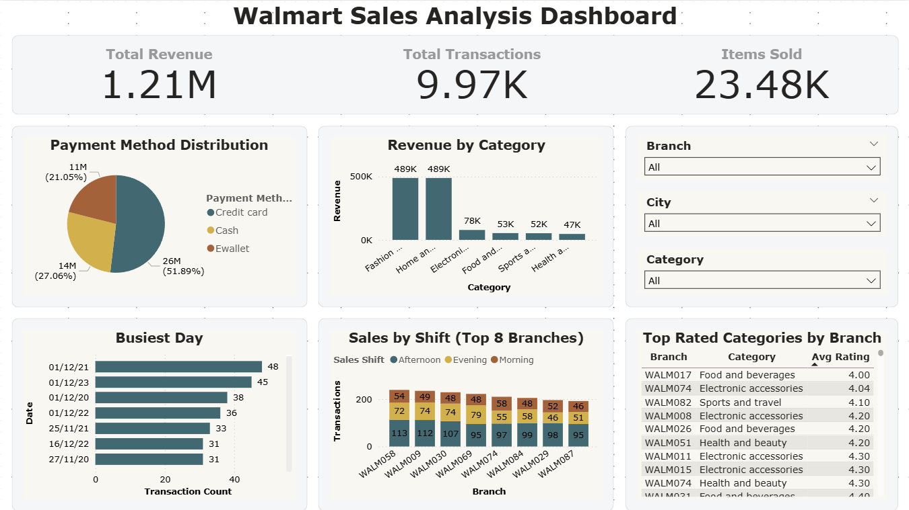

# Walmart Sales Analysis using Python, SQL & Power BI

---

## 📌 Project Overview

This project focuses on analyzing Walmart sales data using **Python, SQL** and presenting insights through an **interactive Power BI dashboard**.

The analysis answers real-world business questions related to revenue, customer behavior, ratings, payment methods, and sales patterns across branches, cities, and time periods.

The goal of this project is to demonstrate:
- **Data Cleaning & Manipulation** using Python 
- Strong **SQL querying skills**
- Ability to translate data into **business insights**
- Clean and professional **dashboard design using Power BI**

---

## 🛠️ Tools & Technologies Used

- **Pandas**
- **MySQL**
- **SQL** (CTEs, Window Functions, Aggregate Functions)
- **Date & Time Functions**
- **Power BI** (Dashboard Creation & Data Visualization)

---

## 📊 Power BI Dashboard

<p align="center">
  
</p>

### Dashboard Highlights

The interactive dashboard provides insights such as:

- **Total Revenue, Transactions, and Items Sold**
- **Revenue distribution by product category**
- **Payment method share**
- **Sales by shift (Morning, Afternoon, Evening)**
- **Top-rated product categories by branch**
- **Branch, City, and Category level filtering**

The dashboard is designed using a **clean light theme**, focused on clarity, readability, and business usability.

---

## 🗂️ Dataset Description

The dataset contains Walmart transactional sales data with the following key fields:

- Branch  
- City  
- Category  
- Payment Method  
- Quantity  
- Rating  
- Date  
- Time  
- Unit Price  
- Profit Margin  
- Total Amount  

---

## 🔍 Business Problems Solved

1. Payment Method Analysis
    - Identified different payment methods.
    - Calculated total transactions and quantity sold for each method.

2. Highest Rated Category per Branch
    - Used window functions to determine the top-rated category in each branch.

3. Busiest Day per Branch
    - Analyzed transaction volume to find peak business days.

4. Sales Quantity by Payment Method
    - Measured item sales distribution across payment modes.

5. Category Rating Analysis by City
    - Calculated minimum, average, and maximum ratings for each category in every city.

6. Profit Analysis
    - Computed total profit per category using profit margin.
    - Ranked categories by profitability.

7. Preferred Payment Method per Branch
    - Identified the most commonly used payment method for each branch.

8. Sales Shift Analysis
    - Categorized sales into Morning, Afternoon, and Evening shifts.
    - Counted invoices per shift for each branch.

9. Revenue Decrease Analysis (Year-over-Year)
    - Compared branch revenue between 2022 and 2023.
    - Identified top 5 branches with the highest revenue drop.

---

## 📂 Project Structure

```
Walmart-Sales-Analysis/
├── walmart.ipynb
├── walmart.sql
├── walmart.pbix
├── walmart.csv
├── walmart_cleaned_data.csv
├── Business_Insights_and_Recommendations.docx
├── requirements.txt
├── README.md
├── .gitignore
```

## 📊 Business Insights

- Sales performance is not uniform across all branches. Some branches consistently generate higher revenue, indicating differences in local demand, customer traffic, or operational efficiency.

- A limited number of product categories contribute the majority of total sales. Other categories have relatively low impact on overall revenue.

- Sales activity is higher during afternoon and evening hours, while mornings show comparatively lower transaction volumes.

- Digital payment methods such as cards and online payments are widely used across branches, showing stable and consistent transaction behavior.

- Customer ratings vary noticeably across product categories. Some categories receive strong ratings, while others indicate lower customer satisfaction.

- Profit margins differ across categories and branches even when sales volumes appear similar, highlighting the importance of cost and pricing strategies.

- Sales trends fluctuate across months and years, showing clear seasonal patterns rather than steady performance throughout the year.

---

## 💡 Business Recommendations

- Analyze underperforming branches separately instead of applying uniform performance targets across all locations.

- Focus inventory planning and promotional efforts on top-performing product categories that drive the majority of revenue.

- Align staff allocation with peak business hours by increasing workforce availability during afternoon and evening periods.

- Encourage the use of digital payment methods to improve checkout efficiency and reduce cash-handling overhead.

- Investigate and improve customer experience in low-rated product categories through quality checks and customer feedback analysis.

- Use profit margin analysis, not just sales volume, when making business decisions to ensure long-term profitability.

- Plan inventory levels and promotional campaigns based on seasonal sales patterns to avoid overstocking or missed demand.


## 🔗 Connect With Me

- **LinkedIn:** https://www.linkedin.com/in/akhilesh-yadav88/
- **Portfolio:** https://yaadavakhilesh.github.io/
- **GitHub:** https://github.com/YaadavAkhilesh
- **Email:** yadavakhil766@gmail.com

---

⭐ If you found this project helpful, consider giving it a star!